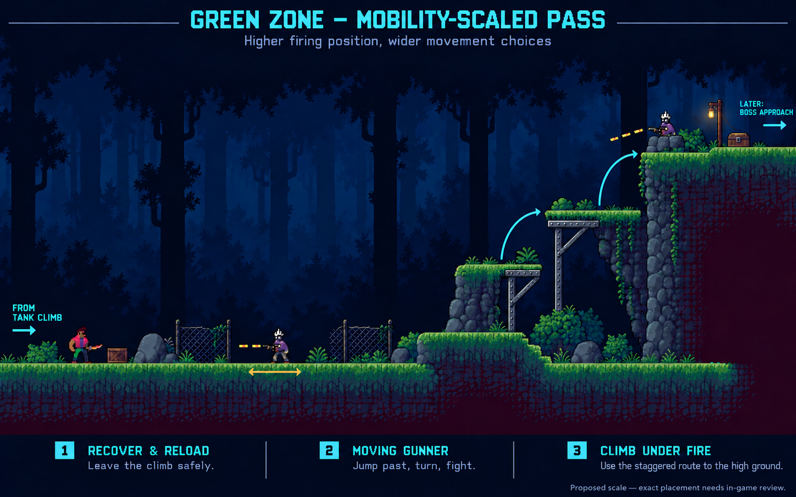

# Level roadmap

World 1, the Green Zone, teaches the movement kit across three substantial
levels. Arrival / Shoreline and Overgrown Coastal Ascent are complete. Green
Zone Finale is playable in development through the handgun introduction, tank
fight and wall-jump escape; the later gunners and boss are the next campaign work.

## Current campaign

| Level | Main arc | Status |
| --- | --- | --- |
| Arrival / Shoreline | Beach arrival, early combat and hazards, Double Jump, forest clearing | Complete |
| Overgrown Coastal Ascent | Dusk approach, cave entry, Wall Jump and Dash, machine chambers, lift departure | Complete |
| Green Zone Finale | Night ravine, underworks descent and return, first handgun, tank fight and escape, later gunners, boss | Traversal, handgun and tank implemented; later gunners and boss remain |

Campaign play can continue into the unfinished finale. The production level
selector lists the first two levels; developer entries provide direct access to
the finale and its gun encounter.

Phantom Camera is now accepted across all five playable sections, including
the cave and the earlier Level 3 route. The handgun cutscene returns smoothly
to gameplay framing; terrain and authored object placements are preserved.
See [camera authoring](PHANTOM_CAMERA.md).

### Level 1: Arrival / Shoreline

The shoreline leads through Green Threshold and Thorn Garden into an open-air
Double Jump rise. Ground enemies, gaps, and spikes establish the basic combat
and platforming language. A skate half-pipe marks the aerial takeoff, and a
tire-swing-tree clearing ends the route.

The first Thorn Garden gap is an enclosed spike pit: its ground walls extend
downward around a stone bed, with lethal coverage across the entire bottom.
The original takeoff and landing heights and jump gap are preserved.

The second Thorn Garden spike pit and the long spike bed after the skate ramp
also have stone floors beneath their existing spikes. The tall ground beside
the second pit extends downward; the floating platforms above the long pit
retain their original shapes and positions.

The gap just before the skate park also has a recessed spike bed. All four lower
spike beds share the same depth and stone surface, with spikes covering each pit
from wall to wall.

The finish records completion and carries the player directly into Level 2
through a matched exit and entrance. A supply chest on the threshold landing
uses the Shoreline loot pool. The route is complete; ongoing combat and supply
balancing should be assessed in the context of that route.

### Level 2: Overgrown Coastal Ascent

A dusk approach leads through a short cave-slide sequence into one connected
interior. The route recaps familiar movement, teaches Wall Jump, turns toward
the Dash pickup, then combines the abilities through hovering-machine chambers
and an enemy-and-spike exit gauntlet. A construction lift carries the player
out toward Level 3.

The cave's lower and upper backgrounds, regional lighting, water vistas, shaft
camera, and lift framing are in place. The
[Level 2 visual brief](LEVEL_2_VISUAL_BRIEF.md) contains the detailed route and
presentation reference. The cave-approach supply chest uses the Green Zone pool,
which introduces the 50-HP medical kit.

Future tutorial text should explain that a slow wall slide lets the player wait
for clearance before kicking away. The upper wall-jump spike pair currently
uses that timing intentionally.

### Level 3: Green Zone Finale

The player arrives on the construction lift at night. A ravine tests Double
Jump and Dash among familiar enemies, followed by a surprise descent into the
underworks and a long, hazard-free Wall Jump return to the surface.

The sparse surface stretch deliberately suggests a reachable jump before the
fall. Its isolated chest rewards exploration of the apparently empty area;
the bare surroundings are intentional.

A section transition leads into the first armed encounter. The player and
shooter notice each other, the opening volley sends the player to real cover,
and control returns for a fight using the existing movement and melee kit.
Defeating the shooter drops the first handgun, which auto-equips with 30 total
rounds. Its first collection pauses for the finished Cyberpunk GUI showcase with
a separate raised header, illuminated frame, weapon display, and Continue button.
Restoring a save or entering a lab with an owned gun does not repeat the reveal.
A nearby supply chest uses the gun-encounter loot pool.

Remaining work in this section:

1. Introduce firing and reloading through the gun-enemy sequence below.
2. Develop encounters that combine shooting and movement, keeping melee viable.
3. Design and build the first boss and the level's ending.
4. Playtest the full sequence and add the finished finale to the production
   selector.

The route now extends beyond the first handgun chest through an enclosed
14.08 m spike pit (X 30.72–44.8). It uses Level 1's construction: deep ground
sides, a recessed stone bed, wall-to-wall spikes and lethal fill. The bed is recessed to Y -3.68, so only
its top stone lip shows at the bottom of the standing camera view. It is sized
for Double Jump plus Dash. Hands-on playtesting owns its feel; do not add a
scripted traversal runner for this gap.

A short, clear landing leads into the tank clearing. This traversal beat gives
the player a breather and connects the two combat spaces naturally. Frame the
tank and layered crate cover before engagement; its opening fire should not
catch the player during the mandatory crossing. Keep its patrol inside the
clearing, away from the pit. Firing is gated until the player is grounded beyond
X 48.64. The tank initially patrols X 57.6–65.28; the climb and upper route now extend to X 104.96.

The next stretch uses only gun enemies, in this order:

1. **Moving Green Zone tank — implemented first pass.** A slow firing cadence and a clear attack tell give
   the player room to learn. It takes eight handgun shots. Nonlethal hits do not interrupt its movement
   or firing cycle; damage feedback remains visible and audible. Its defeat
   creates a pause to reload before moving on, with the timed reload bonus
   introduced as an optional improvement.
   Cover is two visible layers of destructible wooden crates: the tank
   removes one box per shot, with the surviving upper box falling into the gap.
   The remaining boxes provide a warning before all protection is lost. Leave room to jump, dash, and fight after the cover is gone.
   The breaking shot stops at the crate; the next windup gives time to reposition.
   See [breakable crates](ideas/BREAKABLE_SUPPLY_CRATES.md) for the prototype and
   the separate, later possibility of supply drops.
2. **Moving dual-gun enemy.** Use the same enemy type as the first handgun
   encounter, with movement enabled for these later placements. It takes the
   approaching-enemy role previously suggested for a skater. The original
   scripted handgun-acquisition encounter stays stationary.
3. **Stationary elevated gunner with cover.** Introduce firing angles and
   choosing when to leave cover, while the gunner holds its elevated position.

The moving dual-gun and elevated gunner encounters remain to be implemented;
the [next-build layout below](#next-build-upper-gunner-route) defines their first pass.
The tank uses Green Zone enemy 6's idle, walk, attack, death and projectile art,
plus the pack's tank shot and movement recordings. Tank and crate cover are
available in the level designer. [Combat balance](COMBAT_BALANCE.md) records
current values and remaining tuning decisions. Bat enemies and skaters are not part
of this new stretch. Melee and movement remain valid player options.

#### Tank exit: wall jumping under fire

The first pass is implemented. Killing the tank is optional: defeating it earns
ammunition and makes the climb safe; leaving it alive means escaping while it
moves beneath the shaft and shoots upward. It keeps firing until the wall-jump
area leaves the camera view. The moving dual-gun encounter after it remains unbuilt.

The left wall-jump face is an open steel scaffold, not a masonry block. Its
bright foreground uprights and girders have matching collision; the darker rear
legs and diagonal braces leave the interior and tank entrance open. This is also
a reusable **Wall-jump scaffold** in the level designer, with width, height and
underpass controls.

Current layout values:

- Shaft faces at X 68.48 and 72.96: a 4.48 m gap.
- Solid right-hand ground rises to Y 25.6; the left scaffold's open underpass
  still reaches Y 3.84. There is only one scaffold.
- The scaffold roof is higher again at Y 35.84. A narrow supported service
  bracket at Y 30.72 splits the optional extension into two reachable wall-kick
  and aerial-jump steps. Its reward stays above the ordinary exit's camera frame.
- Two left-facing spike patches on the right wall span Y 8.96–11.52 and
  Y 17.92–20.48. Clean wall sections above, between and below them leave room
  to time the crossing; the final lip is clear.
- A supply chest at X 65.28 on the left scaffold roof uses **Better supplies**.
  It remains editable in the designer and uses ordinary chest/save behavior.
- Tank firing position at X 70.72. The approach is short enough to give the
  slow tank a useful firing lane without changing its movement speed.
- Solid upper ground shelters the player; the WIP upper route ends at X 104.96.
  Passing the climb's former X 75.52 exit no longer ends tank fire on its own.
- The spare far crate pile now sits on the upper ledge. The opening dash pit,
  two main cover piles and authored chest remain in place.

A Phantom Camera rail frames the tank and climber during the exposed ascent,
with a continuous approach and upper-exit reveal. That lower-route camera feel
is accepted. Continuing above it enables Phantom's upward follow for the roof
reward and jumps above it, returning to the rail on descent or along the raised
right-hand exit; see
[camera authoring and checks](PHANTOM_CAMERA.md).
The forest backdrop extends above its original coverage. Engagement persists
inside the authored clearing/climb region even when camera framing changes.
An already-engaged tank can continue firing from below the camera while the
player climbs the shaft or explores its roof; it cannot acquire the player off
screen. This placed tank's shell range is 48 m, covering the visible roof and
jumps above it, with its existing
9 m/s speed and cadence. In the climb phase the tank advances to
the firing position instead of stopping four units from the player. Actual
hazards and unsupported ground still stop it.

The barrel aims upward during the tell, locks its direction for the firing
animation and releases a straight-moving shell. The source barrel art is posed
separately while the tracks and brain remain upright. Horizontal clearing fire,
shell cadence, damage, speed, interruption immunity and psychic punishment
retain their existing values. Solid upper ground blocks shots from below.
The last part of the shaft/scaffold leaving the camera cancels unfired attacks
and sends the tank back; solid ground still blocks shots at the upper exit.
Returning to the clearing can restart the fight without healing it.

Defeat grants **30 reserve handgun rounds** once, with the existing ammo pickup
effect. Eight accurate shots give a net gain of 22 rounds. The reward is editable
per tank placement and does not refill the loaded magazine. Defeat and reward
are saved together: loading after the kill keeps the tank defeated without a
second reward; loading before it restores the earlier tank and inventory.

Focused checks cover real scaffold contact and open gaps, tank clearance,
under-shaft movement, lethal wall spikes, long upward hits, upper shelter,
camera-based disengagement, reward
claims, save restoration and designer placement. The fullscreen MCP view has
been inspected. Hands-on testing still owns the climb rhythm and final visual
acceptance; no automated traversal runner is used for this section.

#### Next build: upper gunner route

**Proposed layout; not built yet.** Continue right from the existing upper ground
after the tank climb. The next lesson is changing position against ordinary gun
enemies, then shooting upward or closing the distance to an elevated enemy.
Start with one of each, encountered separately. Keep the accepted tank clearing,
shaft, scaffold roof reward and opening gun cutscene as they are.

The mockup shows the intended composition, not measured geometry or finished
assets. Its [generation prompt](concepts/green_zone_upper_gunners_v2.prompt.txt)
records the visual brief. Suggested coordinates below are for the first layout
pass and may move to achieve the right framing and combat spacing.

**Scale the layout to the player's actual movement.** The first image compressed
the height changes too far: a 3.84 m perch with a 1.92 m step is easily cleared
with this level's full ability kit. Future mockups should retain a consistent
player size and show meaningful jump heights and horizontal travel before
adding scenery. A composition that looks tall is not enough.

The current [movement resource](../resources/player/default_movement.tres) uses
14 m/s jumps, 38 m/s² gravity, 8 m/s running and a 22 m/s, 0.25-second dash.
Ideal figures, before input release, discrete physics and collision margins:

- Full single-jump rise: about **2.58 m**; apex-timed double-jump rise: **5.16 m**.
- Dash alone travels **5.5 m**, suspends falling and resets vertical velocity;
  it does not grant extra jump height. Spending it during ascent sacrifices the
  remaining rise unless the player still has an aerial jump.
- A wall kick rises about **3.58 m** from contact; an unused aerial jump can
  add another **2.58 m**. Include the approach jump when assessing a shortcut:
  ideal ground jump, one wall kick and aerial jump can total about **8.74 m**.
  Alternating wall contacts offer further climbing routes.
- Same-height ideal horizontal reach is about **11.8 m** with two jumps or
  **17.3 m** with two jumps and dash. Maximum horizontal reach and maximum rise
  require different input timing; do not combine them into one jump envelope.

The revised first pass puts the firing shelf **9.6 m above the approach**,
with useful landings at **+3.2 m and +6.4 m**, spread about **6–8 m apart**
horizontally. This gives a real approach under fire rather than a decorative
step. Those are layout targets, not a guarantee against every shortcut. Skilled
wall-jump/dash routes are welcome; do not shrink the player's abilities or add
invisible barriers just to force one solution. Allow generous landing margins.

| Beat | Initial layout | Player decision |
| --- | --- | --- |
| Recovery after the climb | Use the existing upper shelf, roughly X 84–104.96 at Y 25.6. A quiet stretch after the shaft leaves view; retain the existing exit crate pile. | Reload, heal if carrying medicine, and see the next threat before engagement. |
| Moving gunner | Extend solid grass-topped ground from X 104.96 to roughly 128. Start one gunner near X 118, patrolling approximately X 112–123. Put a rock/ground shoulder near the entrance, with an open fighting lane beyond. | Shoot from range, jump over and turn back, or close for knife/stomp attacks. |
| Elevated gunner | A rock shoulder separates the first fight from a broad ascent around X 130–160. The gunner's solid shelf is +9.6 m above the approach (world Y 35.2), with staggered, supported landings at +3.2 m and +6.4 m. | Shoot diagonally upward, cross between landings during firing windows, or use the walls and aerial kit to reach the gunner for melee. |
| Recovery and continuation | Continue the raised shelf toward roughly X 173. Place one modest supply chest beyond the elevated position and leave space for the later boss approach. | Collect supplies and prepare; the boss entrance and save placement remain a later layout decision. |

Keep a continuous lower floor beneath the ascent so a missed landing returns
the player to the approach. Use broad staggered outcrops and a supported service
bracket, with at least one sheltered place to reassess between exposed moves.
This is an open ascent, not another narrow scaffold shaft. The preceding climb
already supplies the lethal platforming pressure. Ground masses extend downward
into darkness; supported steps, rock faces, broken fences and small maintenance
fixtures make the space read as an overgrown service route. Crates should sit
where supplies could reasonably be stored, rather than forming another tidy
wall of boxes. Continue the blue night forest with restrained utility lights.

**Moving gunner behavior.** Add an optional mobile mode to the existing dual-gun
enemy; the original acquisition encounter and elevated placement remain
stationary. The source pack already has the matching
`enemies/green_zone_enemies/2/Walk.png`; promote that animation when implementing
movement. The current production visual has no walk state yet.

As an initial tuning proposal, walk at about 2.6 m/s and seek a firing distance
of roughly 4–6 m. Stop to telegraph and fire, then reposition after recovery.
Retain the existing visible windup, three paired firing beats and normal hit
interruptions. Jumping over it makes it turn and pursue after its current
attack/recovery, not fire instantly backward. Pursuit stops at unsafe ground,
blocking terrain or the authored encounter boundary; patrol endpoints alone
must not make it forget an engaged player. Only acquire a player while visible.

**Elevated gunner behavior.** Hold position behind a low rock/metal lip that
blocks low shots while leaving its guns and upper hurt region exposed. Match
real bullet paths to the art: the lip must not absorb its own downward volley
or every return shot. It uses the existing downward aim art and a locked aim
for each firing beat. Increase this placement's vertical engagement tolerance
to cover the full approach and jump arcs; the current 3 m default and 8 m
inspector range are too small for this height. Check detection and projectile
range together, retaining visible, unobstructed acquisition. The two landings
and usable wall faces give an ammo-free approach and stomp route.

Separate the activation areas and sightlines so the elevated gunner cannot
start its introduction during the moving gunner's first volley. A player may
choose to rush ahead with the first enemy alive, but pursuit ends before it
follows onto the elevated emplacement. No mandatory kill gate or tank-style
interruption immunity is proposed for either gunner.

Keep the provisional **50 HP and 25 damage** baseline: two accurate handgun or
knife hits, or one stomp. Each simultaneous bullet pair remains one damage
opportunity. Start with a proposed **6 reserve rounds per defeated gunner**,
editable per placement and saved with its defeat, to reward fighting without
matching the tank's larger payout. The exit chest uses the existing variable
gun-encounter pool. Reward amounts need testing across the whole route; no free
healing or automatic magazine refill is added. Existing autosave/manual-save
rules still restore saved health and supplies exactly.

Build the moving gunner and its flat encounter first, then the elevated
emplacement. Extend the existing Phantom rail continuously along the new ground
and upward toward the raised shelf. Reveal the gunner before its first shot;
then keep the player and next landing visible through the larger jumps. Do not
zoom out or shrink the character to fit the entire ascent at once. Keep enough
headroom for jumping over the moving enemy; do not
introduce camera-priority cuts. Integrate these placements with the level
designer, and preserve authored layouts when extending the scene.

Check stop/fire/recover/turn behavior, normal interruptions, ledge protection,
paired damage, camera visibility, muzzle clearance, melee access, and saved
defeat/rewards with focused checks and an MCP playtest. Hands-on testing owns
encounter rhythm and cover placement. There is no need for another automated
route or pit traversal runner.

Most ordinary fights can be bypassed. Their rewards make fighting worthwhile;
the tank's ammo and safe climb are the first concrete example. Boss melee
openings remain necessary so these optional rewards do not become a hidden
requirement to finish the level.

The boss should have clear attack patterns and meaningful vulnerability windows.
Melee remains a viable way to win with no ammunition. The golf-cart/driver art
is a candidate for a movement set piece and possible second form; the boss
choice and behavior are still open. Moving saws are reserved for a later level.

## Combat and supplies

Health, hit interruptions, healing, inventory, Q/E quick use, ammunition,
active reloads, manual saves, and autosaves are implemented. Supply chests work
in campaign sections and in the level designer, using level pools or fixed
contents. These systems now need integrated balance testing.

The next tuning questions are:

- How handgun damage and reload timing compare with knife attacks and stomps.
- Gunner durability, overlapping attacks, recovery periods, and interruption loops.
- How much healing and ammo accumulate across a level and between saves.
- General enemy drop rates and where stronger healing items should appear.
- Boss durability once its actual attack pattern and melee openings exist.

[Combat balance](COMBAT_BALANCE.md) owns the targets and provisional values.
[Supply chests](CHEST_LOOT.md) owns loot-pool tuning and authoring, and
[inventory and saves](SAVE_SYSTEM.md) explains recovery behavior.

## Interface and presentation

The compact health HUD, Q/E slots, paused inventory, options menu, save/load
pages, gun HUD, floating pickup icons, and weapon-unlock showcase are implemented.
Further work includes:

- A visual polish pass on the active-reload bar.
- Settings behind the current placeholder option.
- Consistent title/level selection and the final game-over composition.
- Tutorial tips, including wall-slide timing and firearm controls.
- Further audio selection and controller/accessibility review.

The Cyberpunk GUI pack provides the visual basis. Crafting, equipment, skill
systems, and a wider economy remain future design choices.

## Later ideas

Possible mechanics for later worlds include moving saws, reactive spikes,
dropping floors, timed platforms, and longer sequences built around the full
movement kit. The [idea notebook](ideas/README.md) holds other exploratory work.

Dash refresh on wall contact is a possible later upgrade. Current routes assume
Dash refreshes on the ground, so changing that rule would alter their reach and
needs to be treated as an ability decision.

World order after the Green Zone, further weapons, upgrades, shops, crafting,
and status-effect items remain open.

## Review before completing a level

A finished level should teach its new mechanics in context, develop them through
readable challenges, and end before repetition becomes padding. Review the full
route at normal speed, including combat, supply availability, saves, deaths, and
recovery. Scenery and camera framing should support clear decisions while moving.

Focused validators check movement, collision, persistence, and transitions.
Hands-on playtesting establishes pacing, difficulty, and visual quality.
New abilities also need a working Firearm Review Lab toggle and focused checks
alongside their campaign introduction.

## Issue to reproduce

An intermittent flash of the death animation at respawn was reported earlier.
The rendered probe did not reproduce it. It remains a low-priority visual issue
for a live reproduction; earlier timing guesses have not established its cause.
